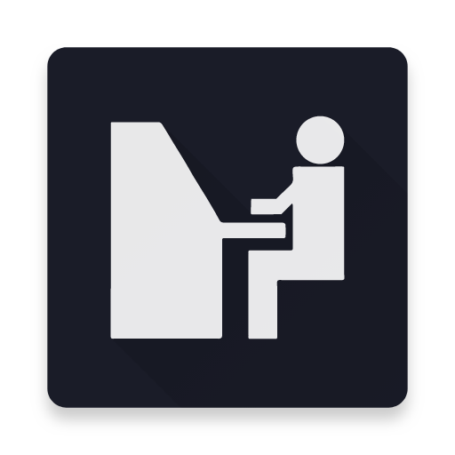

  

<h1 align="center">Fighthub</h1>

Um pequeno site/PWA feito em react para listar os eventos do fighthub, um calendário público de eventos da comunidade brasileira de jogos de luta.

  <a href="https://fighthub.netlify.com">https://fighthub.netlify.com</a>

---

# To-do
- [ ] Mudar o moment.js para days.js
- [ ] Criar um prop e css relacionado para eventos passados
